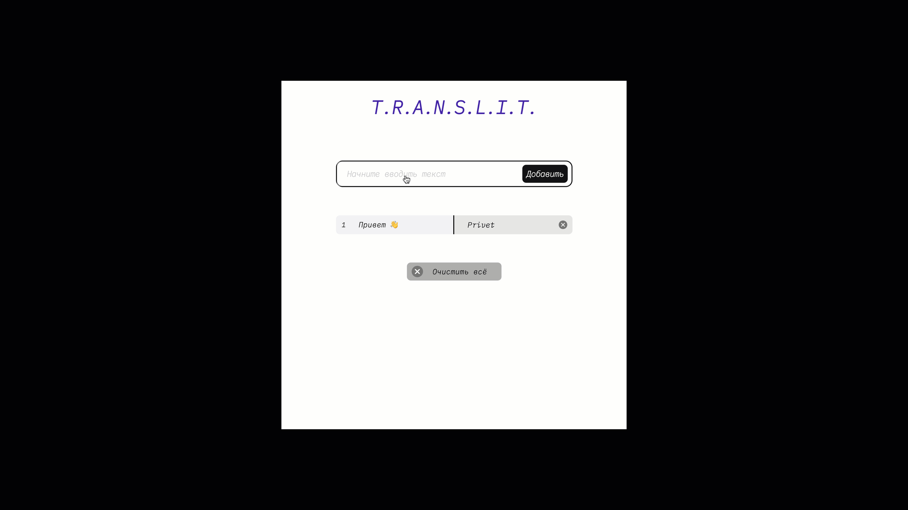

# T.R.A.N.S.L.I.T.

[Макет Figma](https://www.figma.com/file/AWCUP5T3n3UnujErifjl2e/ECB-Phase-0-tasks-T.R.A.N.S.L.I.T.-share?node-id=0%3A1)

Приложение, которое превращает текст на русском языке в его транслитерацию и сохраняет её в словарик.

Проект доступен по адресу: https://nastiashh.github.io/transliteration-DOM/

Реализовано с помощью DOM.

## Стек:
- HTML;
- CSS;
- JavaScript.

## Функциональность:
- транслитерация слова, введеного в поле ввода;
- удаление строки со словами;
- присваивание номера каждой строчке и их обновление при добавлении/удалении любой строчки;
- добавление ... если слово длиннее 7 букв;
- при наведении на такое слово появлется подсказка с полной версией слова;
- кнопка сброса всех добавленных слов в словарик.

## Реализовано:
- Document Object Model;
- методология БЭМ;
- соблюдение семантики;
- позиционирование элементов;
- flexbox-верстка;
- адаптивная верстка;
- работа с Figma.
